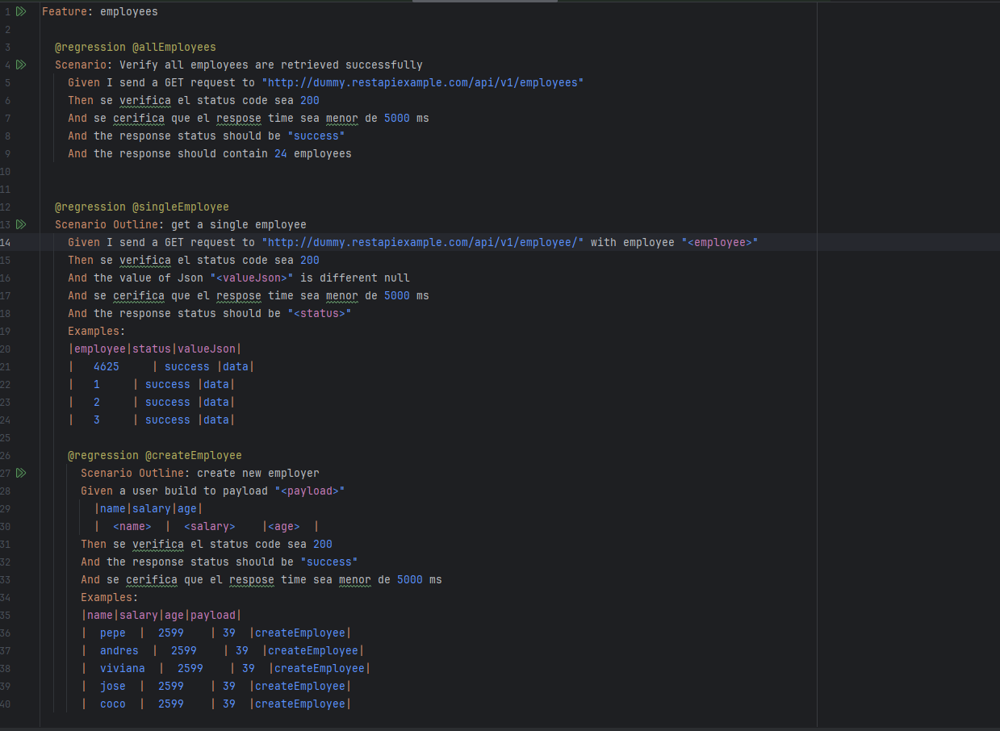

# Automation LULOX (API-WEB)

[](URL_DEL_CI/CD)
[](URL_DEL_REPORTE_DE_COBERTURA)
[](LICENSE)

Este proyecto permite la ejecución de pruebas web y pruebas de API.

## Tabla de Contenidos

*   [Descripción](#descripción)
*   [Casos automatizados](#casos-automatizados)
*   [Tecnologías Utilizadas](#tecnologías-utilizadas)
*   [Requisitos Previos](#requisitos-previos)
*   [Configuración del Proyecto](#configuración-del-proyecto)
*   [Contacto](#contacto)

## Descripción

En este proyecto se encuentra la ejecución de pruebas automatizadas en entorno web, donde se interactuda
con un navegador seleccionado ejecutando acciondes dentro de el, ademas la ejecucion de APIS disponibilizadas, se 
utiliza lenguaje de programacion JAVA, manejo de dependencias MAVEN,
frameworks como JUNIT,SELENIUM, CUCUMBER, RESTASSURED.

## casos-automatizados

se realizo la automatización de los siguientes casos en lenguaje Gherkin:


API Test


## Tecnologías Utilizadas

*   Java (versión 17.0.10)
*   Selenium (Versión 4.25.0)
*   Maven/Gradle (versión 3.9.6)
*   Rest Assured (versión 5.5.0)
*   Cucumber (versión 7.11.1)
*   JUnit (versión 4.13.2)

## Requisitos Previos

*   JDK instalado
*   Maven instalado
*   Allure Instalado

## Configuración del Proyecto

1.  Clonar el repositorio:

    ```bash
    git clone https://github.com/Thainer96/test-automation-LuloX
    ```

2.  Navegar al directorio del proyecto:

    ```bash
    cd src
    ```

3.  Construir el proyecto con Maven/Gradle:

    ```bash
    mvn clean install  # Maven
    ```

## Ejecución de las Pruebas

### Pruebas API

```bash
mvn test # Maven
```

### Ejecución de reporte de pruebas

```bash
mvn allure:report
mvn allure:serve 
```
